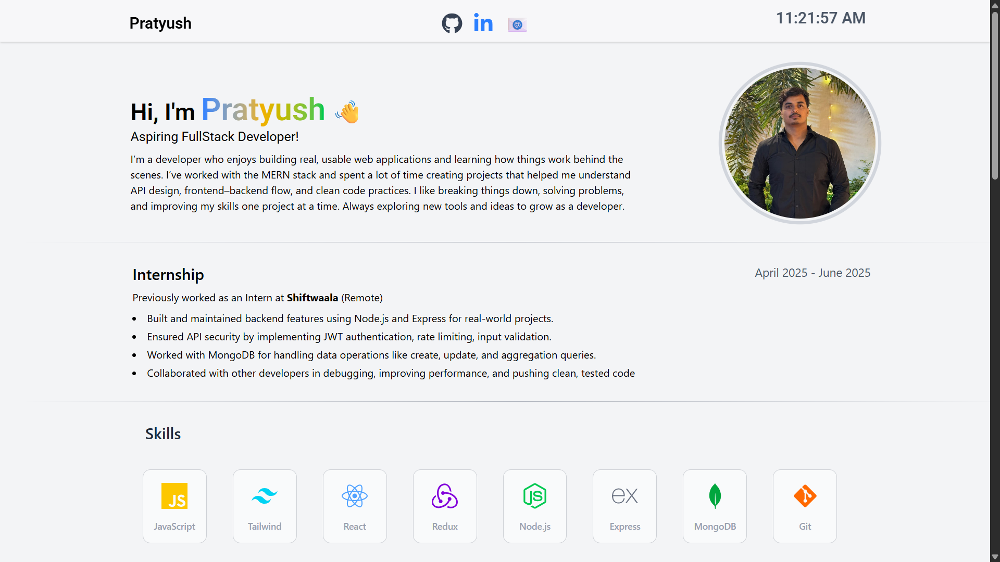

# 🧑‍💻 Personal Portfolio — Pratyush Mishra

This is my personal developer portfolio built using **React.js**, **Tailwind CSS**, and **Framer Motion**.  
It showcases my projects, skills, certifications, and internship experience — all designed with smooth animations and a clean responsive layout.

---

## 🚀 Live Demo
🔗 [View Portfolio](https://personal-portfolio-xi-seven-62.vercel.app/)

---

## 🧩 Tech Stack

- **Frontend:** React.js, Tailwind CSS  
- **Animations:** Framer Motion  
- **Deployment:** Vercel  
- **Version Control:** Git & GitHub  

---

## 🧠 Features

- 📱 **Fully Responsive** design — works smoothly on all devices  
- ✨ **Animated sections** using Framer Motion for a clean, modern feel  
- 💼 **Projects showcase** with hover effects  
- 🎓 **Certificates section** with clickable certificate previews  
- 🧰 **Internship & Skills sections** highlighting real-world experience  
- 📌 **Sticky Navbar** with blur background for smooth navigation  

---

## 📂 Folder Structure
```
portfolio/
 ├── public/
 ├── src/
 │   ├── assets/              # Images & certificates
 │   ├── Components/          # All reusable components
 │   │   ├── About.jsx
 │   │   ├── Certificates.jsx
 │   │   ├── Divider.jsx
 │   │   ├── Footer.jsx
 │   │   ├── Internship.jsx
 │   │   ├── Navbar.jsx
 │   │   ├── Projectshowcase.jsx
 │   │   └── Skills.jsx
 │   ├── App.js
 │   └── index.js
 ├── package.json
 ├── tailwind.config.js
 └── README.md
```

---

## ⚙️ Setup Instructions

1. Clone the repo:
   ```bash
   git clone https://github.com/<your-username>/personal-portfolio.git
   ```

2. Navigate to the folder:
   ```bash
   cd personal-portfolio
   ```

3. Install dependencies:
   ```bash
   npm install
   ```

4. Run locally:
   ```bash
   npm run dev
   ```

5. Open in browser:  
   [http://localhost:5173](http://localhost:5173)

---

## 📸 Preview





---

## 👨‍🎓 About Me
Hi! I’m **Pratyush Mishra**, an aspiring **Full Stack Developer** who loves building real-world applications using the **MERN stack**.  
I focus on writing clean, maintainable code and continuously improving my problem-solving and backend integration skills.

---

## 💌 Contact
- 📧 Email: sibbumishra9161@gmail.com  
- 💼 LinkedIn: [linkedin.com/in/pratyushmishra](https://www.linkedin.com/in/pratyush77/)  
- 🐙 GitHub: [github.com/your-username](https://github.com/PratyushM77)
